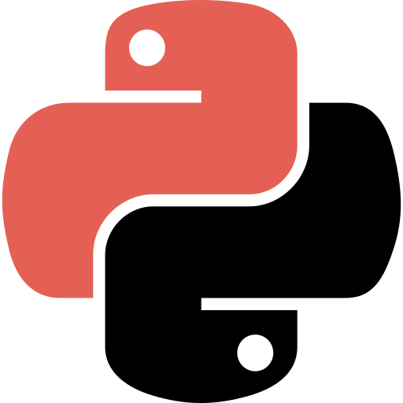

<header>
  
<h2> <> SOBRE MIM </h2>
  
</header>

<br />

<div>   


```c++
#ifndef
#define BIOGRAFIA_H

#include <Bibliogradia.h>
#include <Arduino.h>

class Undergraduate {
    public:
        void nome(const char * Gabrie_Volpato_Parpineli); 
        void cursando(char Engenharia_Eletric);
        void objetivo(uint8_t Desenvolver_aprimorar_projetos_pessoais, char e_de_extenção);
        void localizacao(char Maringá, float PR);
        void interesses(int Eletronica, int Back-end, int Automação);
        void formacao(int Tecnico_Analise_Desevolvimento_Sistemas, char SENAI_FIEP);
    }
};

#endif 
```
</div>

<br />

<div align="center" >
<h2 align="center" > Linguagens e ferramentas  </h2>

<code></code>
<code></code>
<code></code>
<code></code>
<code></code>

</div>
    
<br />

<br />

<div align="center">
  <h2> Estatísticas </h2>

  
  &nbsp;&nbsp;&nbsp;&nbsp; 
  
</div>

<br />

<footer>
<h2 align="center">
Obrigrado pela atenção. </>
</h2>
</footer>
